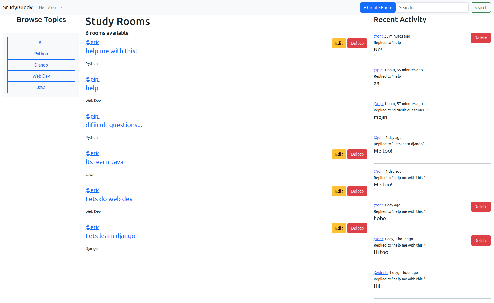
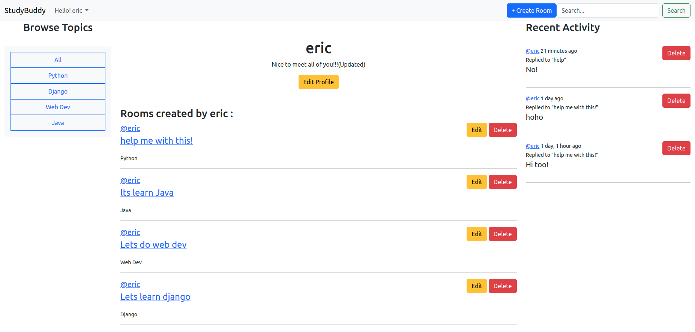
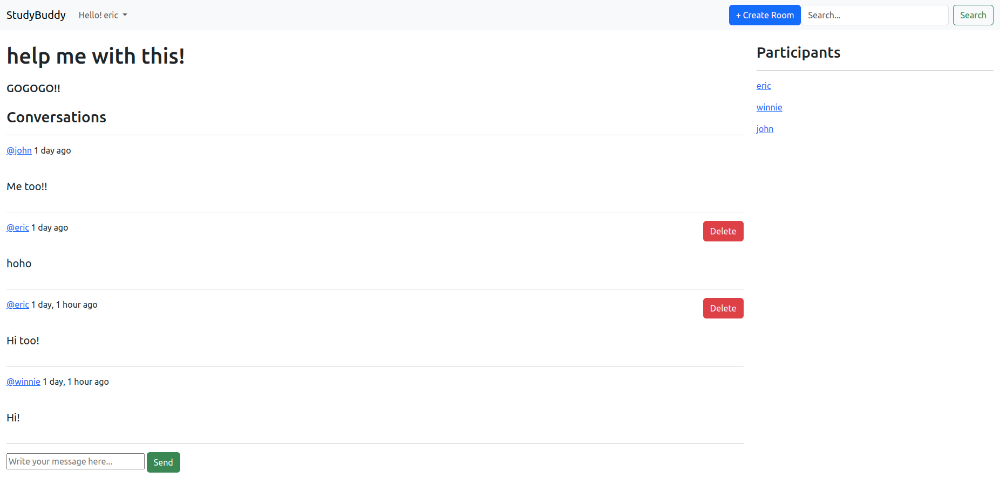
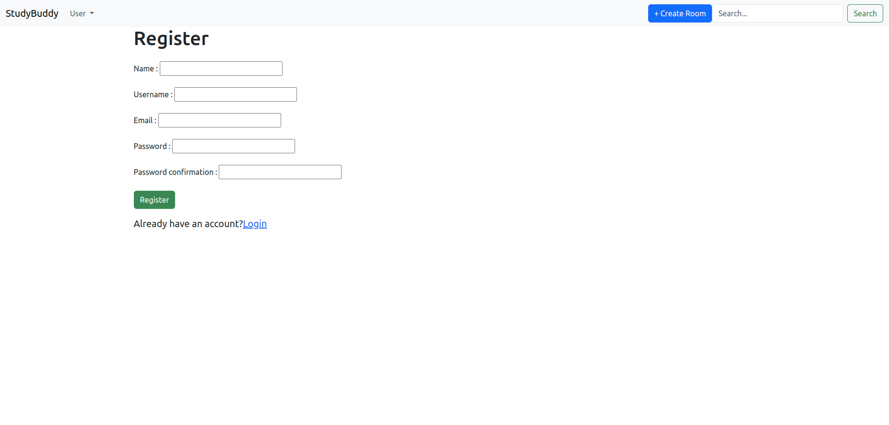

# StudyBuddy
A platform for people to study coding and communicate with each others.

## Features

- User

1. Create user
2. Browse user profile
3. Update user
4. Delete user

- Room

1. Create room
2. Browse rooms
3. Update room
4. Delete room

- Message

1. Create message for specific room
2. Browse messages for specific room
3. Update message for specific room
4. Delete message for specific room

- Browse recent activities
- Search for specific topics, rooms

## .env datas

- DJANGO_SECRET_KEY
- DEBUG

## App Preview

- Home page
  

- Profile page
  

- Room page
  

- Register page
  

